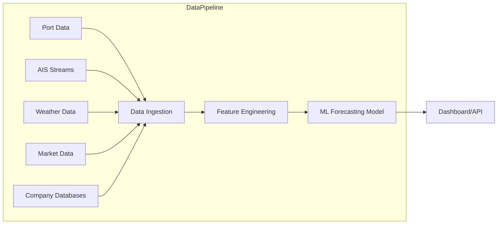
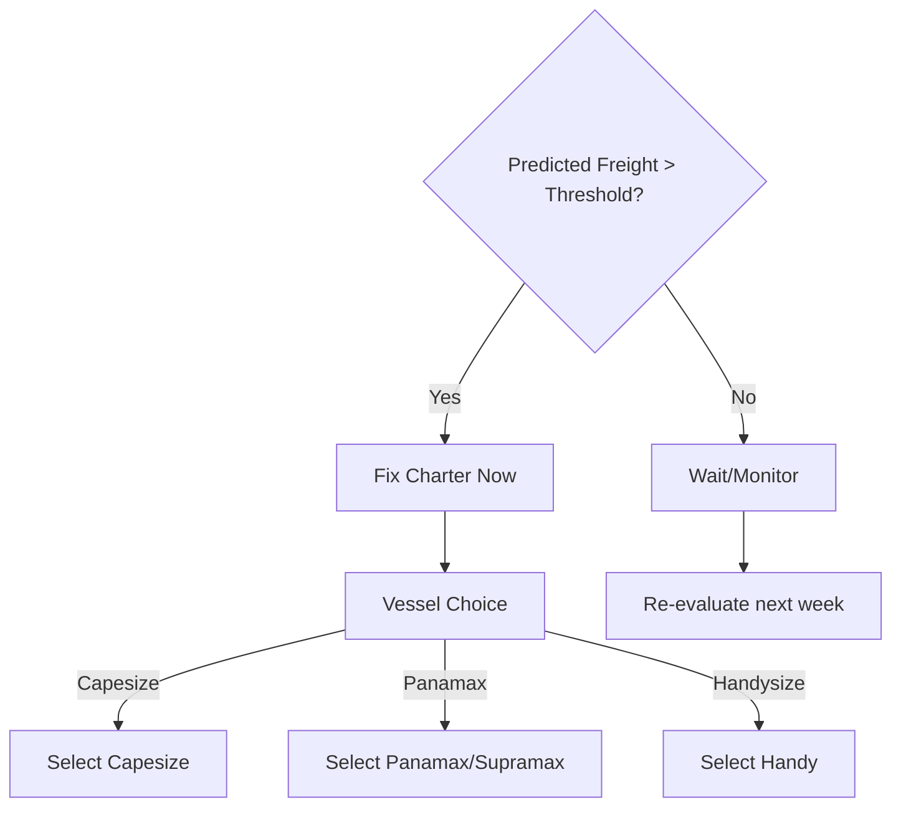

# Executive Summary  
Bulk-cargo chartering to India’s East Coast is currently reactive and market-driven, causing inefficiencies and high costs. An *intelligent freight forecasting model* is needed to predict market conditions (freight rates, demand, weather, etc.) and recommend **optimal chartering actions**: when to fix ships, which vessel type to choose, how much cargo to buy, and routing options. Key goals include minimizing spot-market costs, reducing vessel idle time, and ensuring cargo delivery schedules. Stakeholders span government (Ministry of Steel, Ports Ministry), importers/steel mills, shipping lines, chartering brokers, and port operators. Constraints include **port infrastructure** (draft, LOA, handling capacity) and **seasonal disruptions** (monsoon rains degrade handling rates), as well as volatile freight markets. We define prediction horizons from daily (short-term spot decisions) to weekly/monthly (voyage charters) and quarterly (annual procurement planning).  

## Problem Framing and Decision Objectives  
The current process “involves daily market exploration” with little predictive insight. Freight markets (e.g. for coal, iron ore) are highly volatile, driven by global supply–demand shocks. Decision objectives include: (a) **Cost minimization** by timing charters when rates are low, (b) **Vessel utilization** by matching cargo size/type to port limits (LOA, draft) and demand, and (c) **Supply reliability** by avoiding delays or stockouts. For example, coal imports from Australia/Indonesia to Paradip or Vizag must respect maximum vessel draft; Paradip’s coal berth permits LOA ≈300 m, beam 46 m, draft ≤16.0 m (high tide). Captains must predict port congestion (queues), tidal windows, and commodity price trends to plan effectively. Ultimately, the model should recommend optimal charter timing (entry points in the market), vessel class (Handy/Supramax/Panamax/Capesize) by cargo size and route, and laycan schedules to ensure on-time loading/unloading.  

## Stakeholders and Constraints  
**Stakeholders:** Key users include steel and cement companies (bulk importers), freight forwarders, chartering brokers, and port authorities (Paradip, Vizag, Gangavaram, Gopalpur, Dhamra, Haldia, etc.). Ministry of Steel and Ports will also use forecasts to guide policy. **Constraints:** Ports impose strict vessel limits. E.g., Kolkata/Haldia (Hooghly River) channel allows ~8.5–9.1 m draft, severely limiting vessel size. Paradip permits up to ~16 m draft at high tide for coal berths. Equipment and manpower shortages during monsoon reduce handling rates. Environmental rules (IMO sulfur caps), seasonal cyclones, and geopolitical events (e.g. sanctions) also constrain options. Logistical constraints include rail/road feeder capacity and customs clearance delays.  

## Prediction Horizons  
We consider multiple horizons: **Very short-term (hours–days):** port status and congestion; **Short-term (1–4 weeks):** spot freight rates for imminent loadings; **Medium-term (1–6 months):** charter rates for contracting multiple voyages and seasonal demand (e.g. pre-monsoon demand surges); **Long-term (6–12+ months):** strategic fleet planning or contract charters for annual volumes. The model must deliver forecasts at all relevant scales (e.g. weekly rates to decide a 30-day charter).

## Candidate Input Features  
We group features by domain. For each, we list type, units, source, frequency, missing-data handling, and expected importance:

- **Freight & Charter Rates:** *Type:* numeric; *Units:* USD per tonne or USD/day. *Examples:* Baltic Dry Index (BDI) components (Capesize, Panamax, Supramax rates), route-specific spot rates from brokers. *Sources:* Baltic Exchange data (primary), Clarksons Reports, Drewry. *Freq:* daily/weekly. *Missing:* fill via interpolation or carry-forward. *Importance:* **High** (direct market signal).  
- **Commodity Prices:** *Numeric (USD/tonne).* E.g. thermal coal, coking coal, iron ore indexes. *Sources:* MCX India (coal), Newcastle coal index, London Metal Exchange (iron ore futures), World Bank Pink Sheet. *Freq:* daily/weekly. *Missing:* interpolation. *Importance:* High – influences shipping demand.  
- **Fuel Price & Currency:** *Numeric.* Bunker fuel price (USD/MT) and USD/INR rate. *Sources:* IEA/Platts, RBI or exchanges. *Freq:* daily/weekly. *Missing:* forward-fill. *Importance:* Medium – affects cost estimation.  
- **Vessel Fleet Data:** *Categorical/numeric.* Vessel class (Handy/Supramax/etc), deadweight (DWT), LOA/beam/draft, age, fuel efficiency (tons/day). *Sources:* Baltic Exchange vessel specs, IMO/Equasis database. *Freq:* static. *Missing:* rarely missing. *Importance:* High – determines which ships can call which ports.  
- **Port Infrastructure:** *Numeric/categorical.* Max draft, LOA, beam per berth, handling rate (tonnes/hr). *Sources:* Official port data (Paradip Port berth specs, Visakhapatnam channel notices, Haldia depth charts). *Freq:* static or monthly updates. *Missing:* None (treat as hard constraint). *Importance:* High (hard limits on vessel choice).  
- **AIS Vessel Data:** *Time-series.* Positions, speeds, ETAs, anchored vessels. *Units:* lat/long, knots, timestamps. *Sources:* AIS aggregators (MarineTraffic, SkyFi). *Freq:* minute/hourly. *Missing:* Interpolate short gaps. *Importance:* High – reveals port congestion, actual voyage progress.  
- **Port Congestion:** *Numeric.* Queue length (ships at anchorage), wait times (hrs/days). *Sources:* Derived from AIS (“# ships waiting”) or port authority reports. *Freq:* daily. *Missing:* Estimate from past or proxy (traffic flows). *Importance:* High – affects laycan and demurrage costs.  
- **Weather/Seasonal:** *Numeric/categorical.* Wind speed, wave height, rainfall, cyclone alerts. *Sources:* India Meteorological Dept (cyclone warnings), NOAA, ECMWF models. *Freq:* daily/hourly. *Missing:* use nearest station or reanalysis. *Importance:* Medium – heavy weather can delay voyages/operations.  
- **Temporal Indicators:** *Categorical/numeric.* Day-of-week, month, quarter, public holidays. *Sources:* Calendar. *Freq:* known. *Importance:* Medium – captures seasonality (e.g. monsoon months).  
- **Economic Indicators:** *Numeric.* Global GDP growth, industrial production indexes, steel output. *Sources:* Govt/stat agencies, OECD. *Freq:* monthly/quarterly. *Missing:* use last known. *Importance:* Low/medium (long-term demand trend).  
- **Trade / Political Factors:** *Numeric/categorical.* Sanctions (e.g. OFAC blacklist), embargo flags, insurance Suez block events. *Sources:* News feeds, government bulletins. *Freq:* event-driven. *Importance:* Low/Medium (rare disruptions).  
- **Charter Party Terms:** *Numeric/categorical.* Existing contract lengths, negotiated flexibility, cargo laydays. *Sources:* Internal records. *Freq:* when contracts change. *Importance:* Low (more model input than feature).  

Table 1 summarizes key features:  

| Feature Category          | Example Feature             | Type       | Unit            | Source (priority)         | Freq      | Missing-Data Handling    | Importance  |
|---------------------------|-----------------------------|------------|-----------------|---------------------------|-----------|--------------------------|-------------|
| **Freight Rates**         | Baltic Dry Index, Route rates | Numeric    | USD/day or USD/ton | Baltic Exchange data, brokers | Daily/Weekly | Interpolate/Forward-fill   | High        |
| **Commodity Prices**      | Thermal coal price, Iron ore | Numeric    | USD/ton        | MCX, World Bank/ICE      | Daily/Weekly | Interpolate              | High        |
| **Fleet & Vessel**        | Vessel DWT, LOA, draft      | Numeric    | ton, m         | Baltic specs, AIS registry | Static    | N/A                      | High        |
| **Port Infrastructure**   | Max draft per berth         | Numeric    | m             | Port Authorities (Paradip, Vizag notices) | Static    | N/A                      | High        |
| **AIS Tracking**          | Ship positions/speeds       | Time-series| deg (lat/long), knots, timestamps | AIS providers | Min-Hourly | Extrapolate, drop gaps    | High        |
| **Port Congestion**       | Queue length (ships at anchor)| Numeric  | count or days  | Derived from AIS, Port data | Daily     | Interpolate              | High        |
| **Weather/Season**        | Wind speed, Wave height     | Numeric    | m/s, m         | IMD, NOAA, ECMWF         | Hourly/Daily | Nearest interpolation    | Medium      |
| **Temporal**              | Month, Monsoon indicator    | Categorical| –              | Calendar                 | N/A       | N/A                      | Medium      |
| **Fuel & Currency**       | Bunker fuel price, USD/INR  | Numeric    | USD/ton, INR   | IEA/Platts, RBI         | Daily/Weekly | Forward-fill            | Medium      |
| **Economic Indices**      | Steel production, GDP       | Numeric    | index, %      | Government reports       | Monthly/Quarterly | Use last known         | Low         |
| **Geo-Political Events**  | Canal/drought alerts        | Categorical| –             | News, IMO notices        | Event     | Flag event (no impute)   | Low         |

*Sources:* freight indices from Baltic Exchange; AIS data from satellite/terrestrial feeds; port specs from official authorities; weather from IMD/NOAA; commodity prices from exchanges.

## Output (Target) Variables  
The model will produce predictions and decisions, for example:  

- **Charter Timing Decision:** *Type:* binary or probability (charter now vs wait); *Unit:* –; *Horizon:* e.g. next 1–4 weeks; *Threshold:* decision to fix if predicted cost savings exceed X% or breakeven (e.g. if forecasted rate > current rate by Y).  
- **Vessel Type Selection:** *Type:* categorical (Handy/Supra/Panamax/Cape); *Horizon:* current charter decision; *Used when:* matching cargo volume to port limits (e.g. Capesize for very large cargo to deep ports, Supramax/Panamax for smaller ports).  
- **Cargo Quantity Forecast:** *Type:* numeric; *Unit:* metric tonnes; *Horizon:* monthly/quarterly (volume of bulk imports needed); *Threshold:* ensure forecasts meet production demand targets.  
- **Routing Recommendation:** *Type:* categorical (e.g. via Cape of Good Hope vs via Sunda Strait); *Horizon:* each voyage; *Based on:* fuel cost and weather (monsoon track avoidance).  
- **Laycan Window Forecast:** *Type:* date range; *Horizon:* upcoming voyage; *Threshold:* earliest/latest possible dates based on ETA and waiting probability.  
- **Cost Estimate:** *Type:* numeric; *Unit:* USD or INR per tonne or voyage; *Horizon:* aligned with charter term; *Threshold:* used to compare against budget or alternative quotes.  
- **Risk Score:** *Type:* numeric (0–1); *Unit:* –; *Horizon:* throughout planning period; *Meaning:* probability of cost overruns or delays (e.g. high if port congested or market volatile).  

These targets translate into actionable outputs: “Charter now a Supramax for 60-day hire” or “procure 200,000 t coal by Q4” with estimated cost and risk. Decision thresholds (like a risk score >0.7 triggers conservative action) would be set by business rules.

Table 2 illustrates candidate outputs:

| Output Variable           | Type           | Unit           | Prediction Horizon     | Example Threshold or Decision Rule           |
|---------------------------|----------------|----------------|------------------------|----------------------------------------------|
| **Charter Decision**      | Binary/Prob.   | –              | 1–4 weeks ahead        | Charter if P(future freight ≥ current)+delay cost > 0.5 |
| **Vessel Type**           | Categorical    | –              | per voyage             | Choose smallest class meeting cargo & port limits |
| **Cargo Quantity**        | Numeric        | metric tonnes  | 1–3 months (cum.)      | Forecast ≥ required demand (e.g. 95% percentile) |
| **Routing Option**        | Categorical    | –              | per voyage             | Select lowest-Cost/Time route                   |
| **Laycan Window**         | Date Range     | –              | per voyage             | Target window to minimize idle anchorage time |
| **Cost Estimate**         | Numeric        | USD (or INR)   | whole voyage/contract  | Within budget variance (e.g. ±5%)            |
| **Risk Score**            | [0,1]          | –              | real-time/continuous   | If >0.8 (high risk), trigger contingency planning |

## Model Design and Evaluation Metrics  
We recommend a multi-model approach. **Baseline** models include naive (e.g. last-known freight rate), ARIMA/ETS for time-series, or linear regression. **Advanced models**: Gradient-boosted trees (XGBoost/LightGBM) and neural nets (LSTM/Temporal CNN, Transformer) can capture nonlinearities and exogenous inputs. Training will use **time-series cross-validation** (forward-chaining splits) to prevent leakage (train on past, test on future).  

**Loss Functions:** For continuous forecasts (rates, volumes), use MAPE or RMSE. For binary decisions, use cross-entropy or F1 (with careful class weighting). **Cost-sensitive considerations:** Under-predicting freight (i.e. expecting too cheap rates) has larger penalty (missed savings) than overpredicting, so a weighted loss or asymmetric penalty can be used.  

**Evaluation Metrics:**  
- *Forecast accuracy:* MAPE/RMSE of freight rate and volume predictions.  
- *Decision accuracy:* Precision/recall of charter decision (should it have chartered).  
- *Business KPIs:* e.g. reduction in average freight cost ($/tonne) vs current practice, decrease in idle days, increase in vessel utilization.  
- *Financial impact:* ROI on model usage.  

We will track metrics over hold-out periods (e.g. past 1-2 years) to validate performance.

## Data Preparation and Feature Engineering  
**Data Volume & Labeling:** We anticipate using several years (5–10 years) of historical data for model training. Labels for supervised learning come from historical outcomes: actual spot charter decisions, costs incurred, delivery delays, etc. If direct labels (e.g. “ideal charter action”) are missing, one can use proxy targets like “minimum achieved freight within next window”.  

**Feature Engineering:**  
- Compute **aggregates/trends**: moving averages and momentum of freight indices and commodity prices.  
- **Lagged variables:** freight and price lags to capture autocorrelation.  
- **One-hot encode** categorical features (e.g. monsoon season, month).  
- **Interaction terms:** e.g. freight rate × vessel class.  
- **Dimensionality reduction:** if many routes, use principal components on correlated indices.  
- **Clustering:** group similar routes/ports to reduce categories.  

**Missing Data:** Impute with statistical methods (forward-fill, interpolation) or domain rules (e.g. if AIS gap, assume vessel stationary).  

## Validation Scheme  
Use **Time-Series Cross-Validation** (rolling window): for example, train on 2018–2020, validate on 2021; then train on 2018–2021, validate on 2022; etc. This mimics real forecasting. Ensure the hold-out period includes varying market conditions. Evaluate on multiple horizons.

## Baseline & Model Recommendations  
- **Naïve baseline:** Last known freight level or historical average.  
- **Statistical:** ARIMA, Prophet for trend/seasonality (but may miss exogenous shocks).  
- **Tree-based:** Random Forest or XGBoost with engineered features (tends to handle mixed data well).  
- **Deep Learning:** LSTM/GRU networks or Temporal Convolutional/Transformer models to capture sequential patterns. Incorporate exogenous inputs (weather, prices) in multivariate LSTM.  
- **Ensemble:** Blend models (e.g. average tree and NN forecasts).  

Feature importance (via SHAP) can validate that logical features (freight indices, AIS congestion) are indeed predictive.

## Explainability  
Use **SHAP values** or **partial-dependence plots** to interpret model outputs (e.g. how freight forecasts change with coal price). Provide explanations in dashboard: e.g. “High coal prices and low fleet availability are driving up predicted rates.” This builds trust with users.

## Deployment & Operations  
- **Latency:** Forecasts can be updated daily; AIS-derived congestion features update hourly if needed. End-to-end latency target: minutes for online inference (after data refresh).  
- **Retraining:** In volatile markets, retrain monthly or quarterly. Monitor concept drift (if model error rises, trigger retraining).  
- **Integration:** Expose via an API or dashboard where users input cargo details (origin, volume, time frame) and get recommendations. Possibly integrate with existing chartering software.  
- **Monitoring:** Continuously track forecast vs actual; log performance.  

**Deployment Diagram (mermaid):**  

## Visualizations and Decision Flow  

- **Forecast Charts:** Time-series plots of historical vs predicted freight rates (with confidence bands).  
- **Port Congestion Map:** Animated chart of vessel queues at target ports (using AIS).  
- **Scenario Analysis:** Bar chart comparing costs under different charter timings or vessel choices.  
- **Decision Flow Diagram:** Logic tree showing:  

- **Pipeline Diagram:** shown above.  

## Minimal Viable Feature Set  
We recommend starting with a minimal set of high-impact features (based on literature and domain knowledge): 
- Freight indices (e.g. BDI components), 
- Port draft limits/LOA, 
- AIS-based queue length, 
- Main commodity price (coal), 
- Seasonal flag (monsoon vs non-monsoon). 

These cover supply (fleet/ports), demand (price), and congestion, and can bootstrap a working prototype. Additional features (weather, currency, detailed fleet data) can be phased in later. 

**References:** Authoritative freight and port data sources are key. For example, Baltic Exchange provides daily time-charter rates; port authorities publish berth specs (e.g. Paradip); AIS aggregators supply vessel tracks; and market analysts note that port congestion “causes delays and increased costs”. We recommend grounding all features and metrics in such primary sources where possible. 

